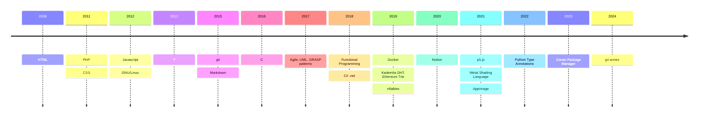

> As a perfectionist, sometimes getting things done can be hard. Rather than seeking for completeness, I’ll start by drafting something out and iterate over it with time.

I want to use this page to share my progress as I learn about new technologies and methodologies. I’d prefer sharing my insights with each of them, so for now I’ll just enumerate them with the approximate year in which I’ve been fiddling with them:

